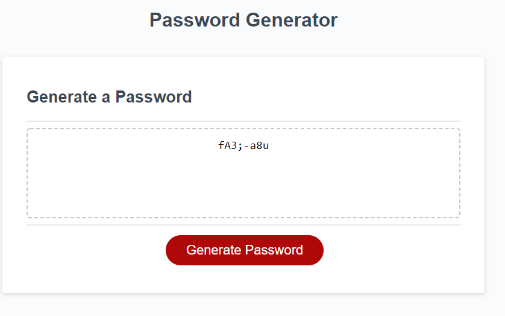

# 03 JavaScript: Password Generator


# The Task

The task for this homework was to create the functions required for a password generator. For this project I created a function that would generate several prompts that asked for criteria for the password to be generated. First I had to generate the prompts, and based on the answer, I had to do the following: 
- Generated a random character of the given type from an array, 
- Add that random character to the existing password string (in order to ensure that the password contained at least 1 character of that type), and
- Add that entire character array to a larger array for later use

After the initial characters were added, the rest of the password was randomly generated based on the large array created earlier in the function. The password was then displayed in the text box on the website.

## Acceptance Criteria

GIVEN I need a new, secure password
    WHEN I click the button to generate a password
        THEN I am presented with a series of prompts for password criteria

    WHEN prompted for password criteria
        THEN I select which criteria to include in the password
  
    WHEN prompted for the length of the password
        THEN I choose a length of at least 8 characters and no more than 128 characters
    
    WHEN prompted for character types to include in the password
        THEN I choose lowercase, uppercase, numeric, and/or special characters

    WHEN I answer each prompt
        THEN my input should be validated and at least one character type should be selected

    WHEN all prompts are answered
        THEN a password is generated that matches the selected criteria

    WHEN the password is generated
        THEN the password is either displayed in an alert or written to the page

Once the changes to the code were implemented, everything needed to be uploaded to a Github Repository

    * Repository contains: 
    *       quality README file with description, 
    *       screenshot, and 
    *       link to deployed application.




Website: https://d-loot.github.io/W03-Password-Generator/

Github: https://github.com/D-Loot/W03-Password-Generator

# Background Information

## Your Task

This week’s homework requires you to modify starter code to create an application that enables employees to generate random passwords based on criteria that they’ve selected. This app will run in the browser and will feature dynamically updated HTML and CSS powered by JavaScript code that you write. It will have a clean and polished, responsive user interface that adapts to multiple screen sizes.

The password can include special characters. If you’re unfamiliar with these, see this [list of password special characters](https://www.owasp.org/index.php/Password_special_characters) from the OWASP Foundation.

## User Story

```
AS AN employee with access to sensitive data
I WANT to randomly generate a password that meets certain criteria
SO THAT I can create a strong password that provides greater security
```

## Acceptance Criteria

```
GIVEN I need a new, secure password
WHEN I click the button to generate a password
THEN I am presented with a series of prompts for password criteria
WHEN prompted for password criteria
THEN I select which criteria to include in the password
WHEN prompted for the length of the password
THEN I choose a length of at least 8 characters and no more than 128 characters
WHEN prompted for character types to include in the password
THEN I choose lowercase, uppercase, numeric, and/or special characters
WHEN I answer each prompt
THEN my input should be validated and at least one character type should be selected
WHEN all prompts are answered
THEN a password is generated that matches the selected criteria
WHEN the password is generated
THEN the password is either displayed in an alert or written to the page
```

## Mock-Up

The following image shows the web application's appearance and functionality:


## Grading Requirements

This homework is graded based on the following criteria: 

### Technical Acceptance Criteria: 40%

* Satisfies all of the preceding acceptance criteria plus the following:

  * The homework should not produce any errors in the console when you inspect it using Chrome DevTools.

### Deployment: 32%

* Application deployed at live URL.

* Application loads with no errors.

* Application GitHub URL submitted.

* GitHub repository that contains application code.

### Application Quality: 15%

* Application user experience is intuitive and easy to navigate.

* Application user interface style is clean and polished.

* Application resembles the mock-up functionality provided in the homework instructions.

### Repository Quality: 13%

* Repository has a unique name.

* Repository follows best practices for file structure and naming conventions.

* Repository follows best practices for class/id naming conventions, indentation, quality comments, etc.

* Repository contains multiple descriptive commit messages.

* Repository contains quality readme file with description, screenshot, and link to deployed application.

## Review

You are required to submit the following for review:

* The URL of the deployed application.

* The URL of the GitHub repository, with a unique name and a readme describing the project.

- - -
© 2021 Trilogy Education Services, LLC, a 2U, Inc. brand. Confidential and Proprietary. All Rights Reserved.
